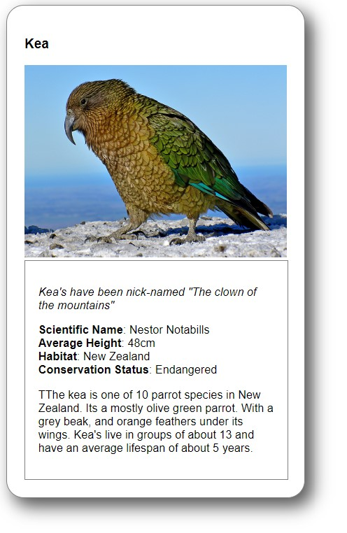
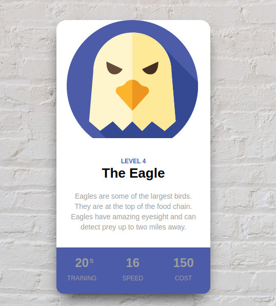

# **Animal Trading Cards**

https://siphiwemanda.github.io/Animaltradingcards/ 

#### Background

This project was project one of the Udacity 'Front End Nano Degree'. The original aims of the project were to meet the following goals: 
- resemble the provided prototype
- use the correct text formatting and styles
- use correct boarders
- the card should have a fixed card width
- image and image tags should be correctly used

### First version

Over time as my skills have grown and developed, I have used this project to improve on my CSS  and design skills while keeping the project in line with its original goals. 

#### Current update

This current iteration improves the card and card positioning as well as working on a slider method, to add more cards.

